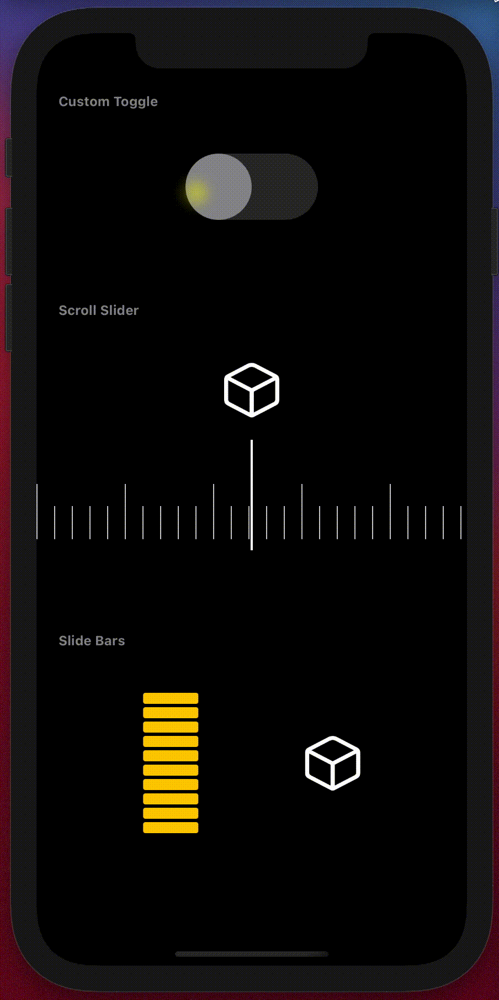

## SwiftUIBits

In this Repo/App I want to collect some SwiftUI experiments & UI componemts I'm working on or using in my projects.
Feel free to use, share & comment.

## Components

## 1. Custom Toggle
A very simple and easy to use custom toggle view.
For everyone  who wants a bit more stlying options than the standard SwiftUI toggle view -> Toggle(isOn: $vibrateOnRing)

## 2. ScrollSlider
This is a HStack as a slide controller made with ScrollView & ScrollViewReader.
I like and use this in one of my projects.  

There is still one issue that bothers me:
The @State vars are beeing updates while the Hstack is scrolling what means that 
there is a "Modifying state during view update" conflict. The solution is as often
GDC which is also as often not the most elegant. If someone has a better solution, please let me know.

## 3. Bar Slider
This Bar Slider can be used as UI controller to animate values.
Each bar sets a value to a bindable var that can be used to animate view modifiers like opacity or rotation.

## Build with
* Xcode 12.3
* for iOS 14

## Installation
1. Download Zip file and open SwiftUIBits.xcodeproj
2. Chose build target iOS Simulator or iPhone
3. Run app by selecting Build button or Command + R

## Licensing:
Public Domain

